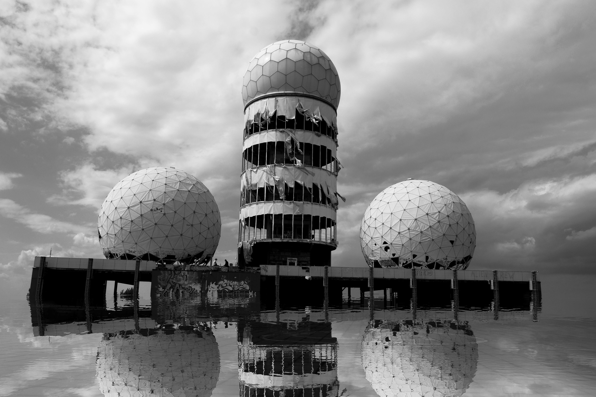
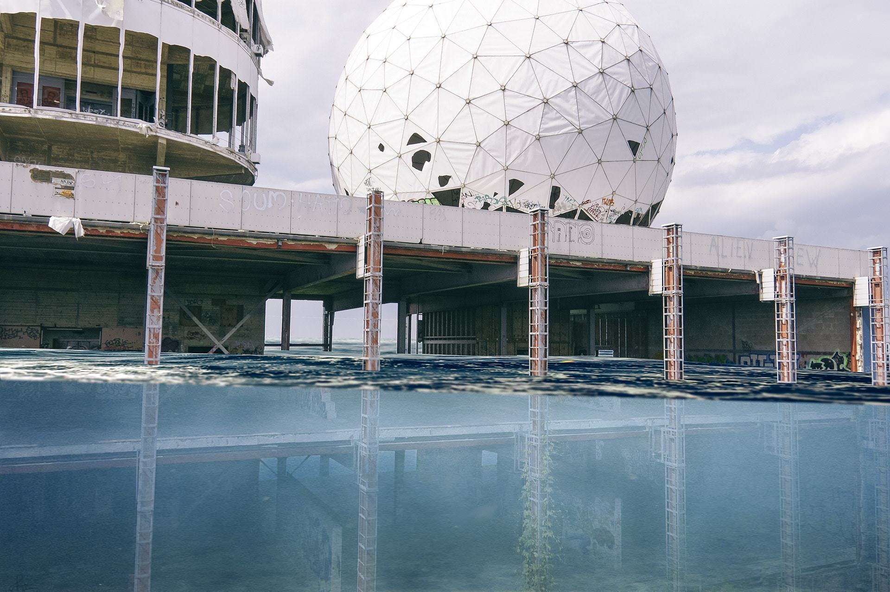
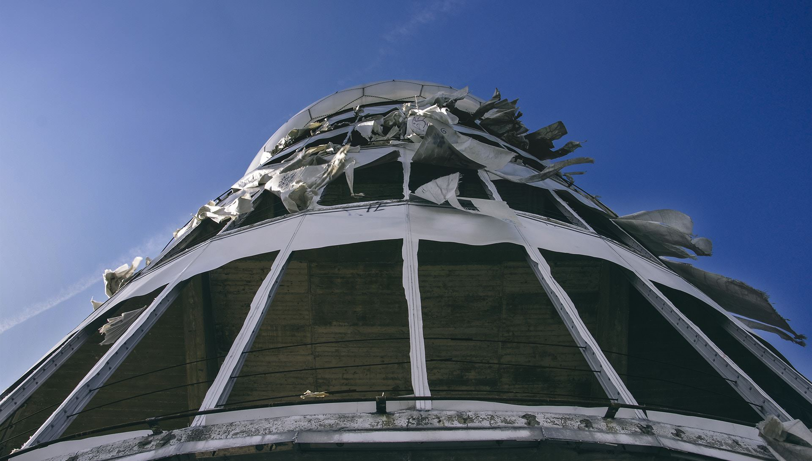
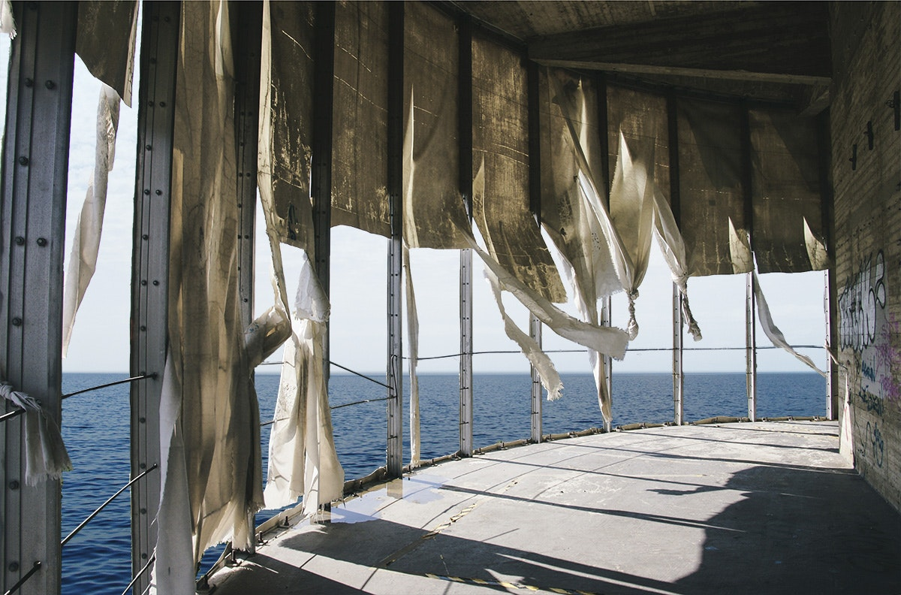
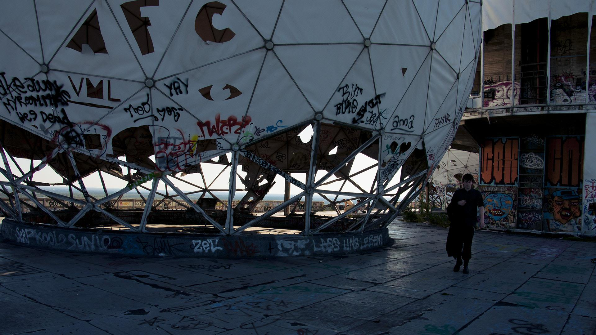

This is an abandoned NSA station on top of Teufelsberg [eng: Devils Mountain], a mountain made out of Berlins World War 2 debris. It was used to intercept soviet radio communication.

As kids, we used to grab our bicycles and spend long summer days exploring the ruins.

> “I like to remember things my own way; How I remembered them, not necessarily the way they happened.”

