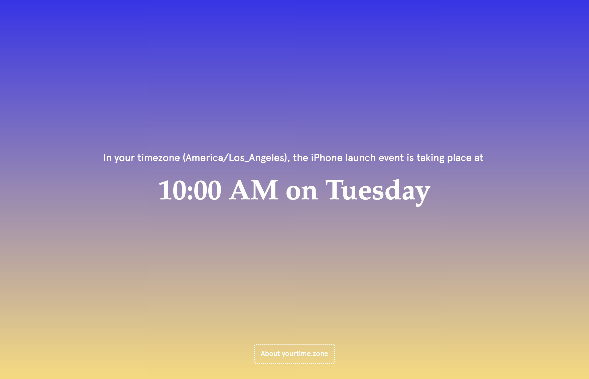
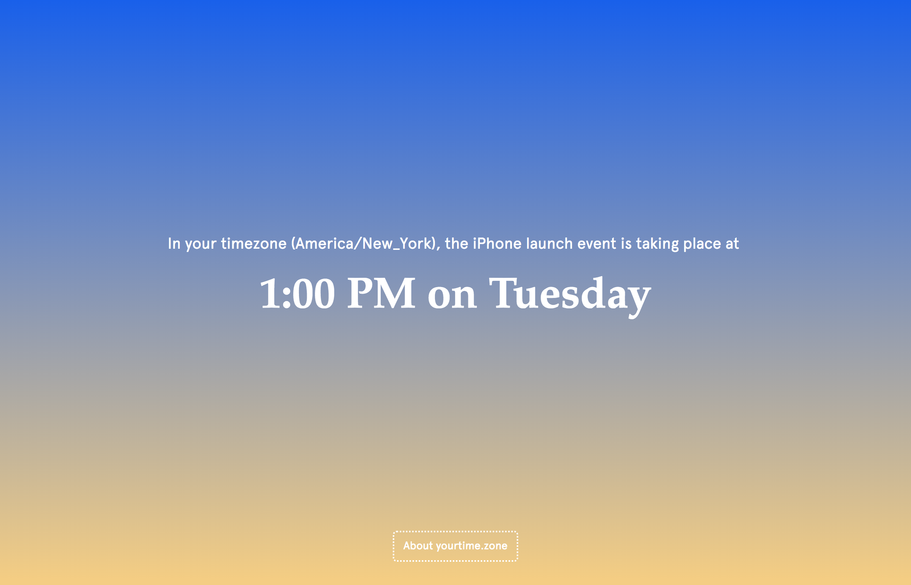
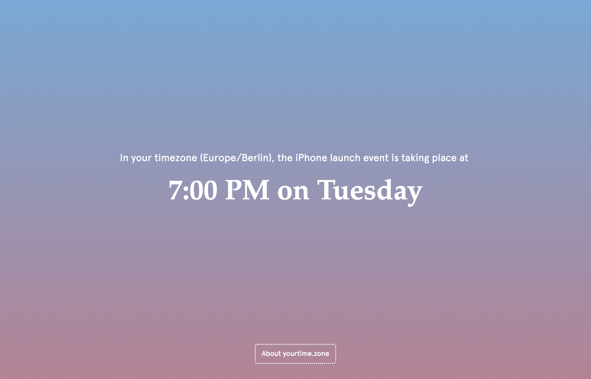
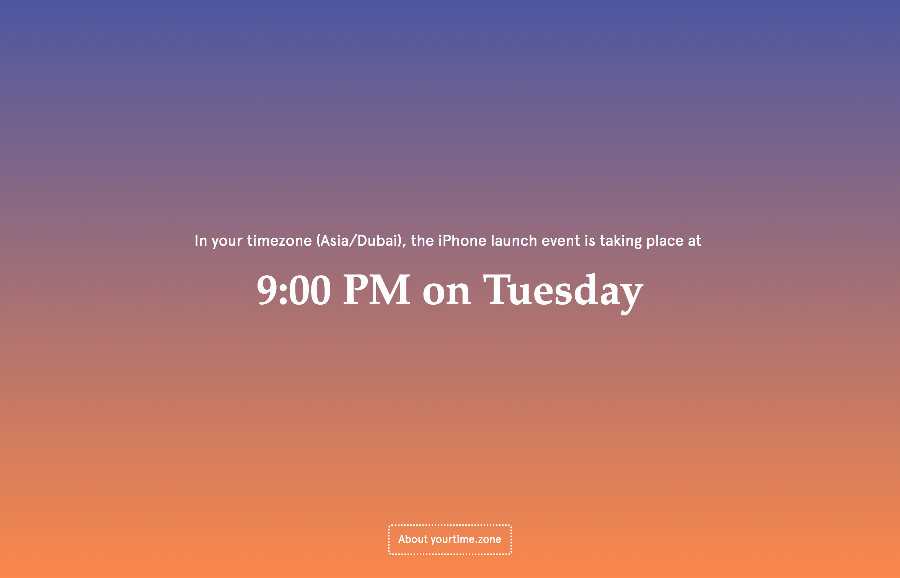
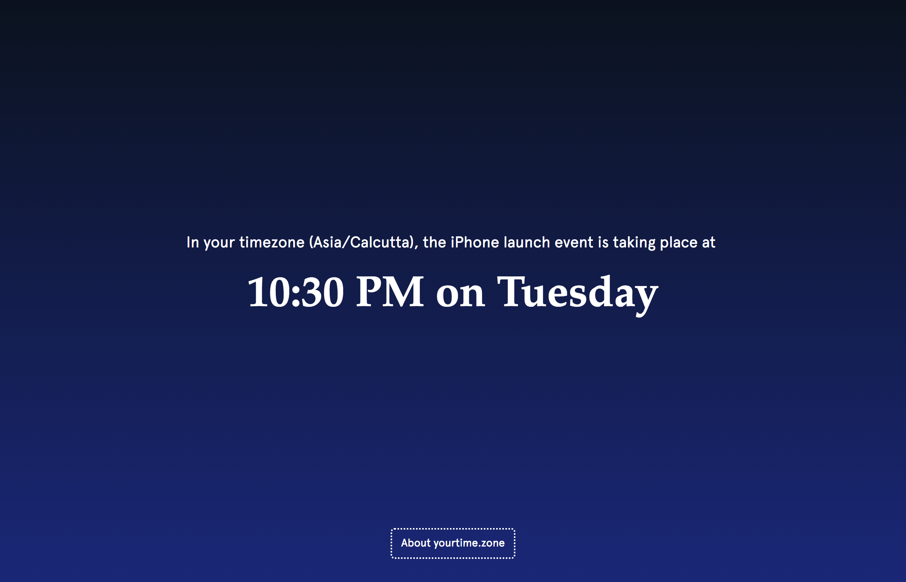
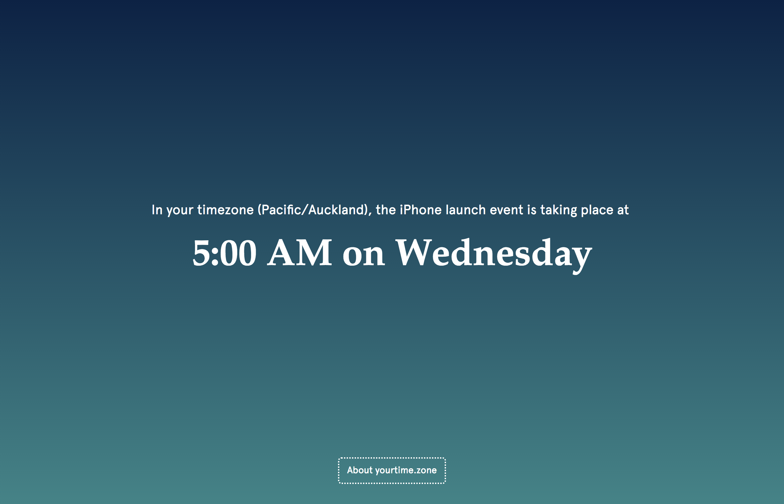

Featured on the frontpage of [Web Designer News](http://www.webdesignernews.com/?s=yourtime.zone), [Product Hunt](https://www.producthunt.com/posts/yourtime-zone).

<a class="button" href="https://yourtime.zone/">Visit yourtime.zone</a>

[Source Code on GitHub](https://github.com/laurajuliette/yourtime.zone)

